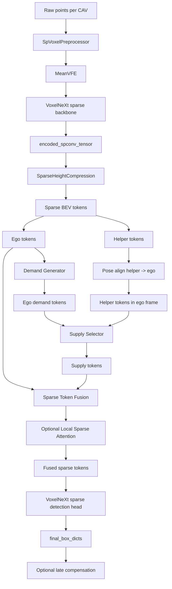

# DDSH-VoxelNeXt 技术实现笔记

> DDSH-VoxelNeXt: Demand-Driven Sparse Hybrid VoxelNeXt for Cooperative 3D Detection.

这份笔记用于后续论文写作和实验复现，记录当前 OpenCOOD 项目中 DDSH-VoxelNeXt 的代码实现、模块接口、稀疏数据流、训练配置、六阶段消融设计和可视化输出。文档描述以当前代码为准，核心入口为：

- `opencood/models/ddsh_voxelnext.py`
- `opencood/models/sub_modules/ddsh/`
- `opencood/hypes_yaml/ddsh_voxelnext_*stage*.yaml`
- `opencood/tools/train.py`
- `opencood/tools/debug_ddsh_forward.py`
- `opencood/visualization/ddsh_paper_vis.py`

---

## 1. 方法定位

DDSH-VoxelNeXt 是一个面向协同 3D 检测的全稀疏中间融合框架。它继承 VoxelNeXt 的 sparse convolution 表达，并避免 OpenCOOD 常见的 dense BEV pipeline。整体目标是：

1. 不把 `encoded_spconv_tensor` 转成 dense feature map。
2. 不生成 `[B, C, H, W]` dense BEV tensor。
3. 不使用 `HeightCompression`、`BaseBEVBackbone`、`spatial_features_2d` 等 dense BEV 流程。
4. 在 sparse BEV token 层面完成 demand generation、supply selection、pose alignment、sparse fusion 和 sparse detection head。

论文中可以将其描述为：

> DDSH-VoxelNeXt keeps the cooperative perception pipeline fully sparse after voxelization. Instead of densifying the VoxelNeXt feature tensor into a BEV feature map, it compresses sparse 3D/2D sparse convolution outputs into sparse BEV tokens and performs demand-driven communication and fusion directly on these tokens.

---

## 2. 总体流程

### 2.1 系统级流程



### 2.2 主模型入口

主模型文件：

```text
opencood/models/ddsh_voxelnext.py
```

核心类：

```python
class DDSHVoxelNeXt(nn.Module)
```

`forward(data_dict)` 的主流程：

1. 从 `data_dict["processed_lidar"]` 读取：
   - `voxel_features`
   - `voxel_coords`
   - `voxel_num_points`
2. 根据 `record_len` 计算总 CAV 数量，构造 backbone 所需 `batch_dict`。
3. `MeanVFE` 聚合 voxel 内点特征。
4. `VoxelResBackBone8xVoxelNeXt` 输出 `encoded_spconv_tensor`。
5. 检查 dense BEV 字段，若出现 dense BEV 字段则报错。
6. `SparseHeightCompression` 得到 `ddsh_bev_tokens`。
7. 根据 `record_len` 将 tokens 按 scene 和 CAV 分组。
8. 调用 `DemandDrivenSparseHybrid` 做 DDSH 六阶段之一。
9. 将 fused sparse tokens 构造成 `spconv.SparseConvTensor`。
10. 输入 `DdshVoxelNeXtSparseHead` 进行 sparse detection。
11. 训练或验证 loss 时输出 `loss` 和 `tb_dict`。
12. 推理时输出 `final_box_dicts`。

---

## 3. 稀疏数据结构

### 3.1 Sparse BEV token 格式

DDSH 使用统一 token dictionary 表示稀疏 BEV token：

```python
tokens = {
    "features": Tensor[N, C],
    "coords": Tensor[N, 3],
    "spatial_shape": [H, W],
    "batch_size": int,
}
```

其中：

```text
coords[:, 0] = batch index
coords[:, 1] = y index
coords[:, 2] = x index
```

即：

```text
coords = [batch, y, x]
```

这点非常重要。DDSH 的 pose alignment、hash fusion、local attention 和 sparse head 都依赖该坐标约定。

### 3.2 为什么不是 dense BEV

传统 OpenCOOD 中间融合常用：

```text
encoded_spconv_tensor.dense()
-> spatial_features
-> HeightCompression
-> spatial_features_2d
-> BaseBEVBackbone
```

DDSH 明确禁止此流程。当前实现中：

- `ddsh_voxelnext.py` 调用 `find_dense_bev_keys(batch_dict)`。
- 如果出现 `spatial_features` 或 `spatial_features_2d` 这类 dense BEV 字段，会由 `assert_no_dense_bev(batch_dict)` 抛出错误。
- `SparseHeightCompression` 不调用 `.dense()`。
- fused tokens 最终通过 `tokens_to_sparse_tensor()` 重新构造为 `spconv.SparseConvTensor`。

论文可写：

> Unlike dense BEV intermediate fusion, DDSH-VoxelNeXt never materializes a dense BEV tensor. All cooperative messages are represented as sparse token sets with explicit integer BEV coordinates.

---

## 4. VoxelNeXt 稀疏 backbone 复用

### 4.1 复用模块

当前实现复用已接入 OpenCOOD 的 VoxelNeXt backbone：

```text
opencood/models/sub_modules/voxelnext_backbone.py
```

主模型中调用：

```python
self.backbone_3d = VoxelResBackBone8xVoxelNeXt(
    args["backbone_3d"],
    self.num_point_features,
    self.grid_size
)
```

输入字段：

```python
batch_dict = {
    "voxel_features": processed["voxel_features"],
    "voxel_coords": processed["voxel_coords"],
    "voxel_num_points": processed["voxel_num_points"],
    "batch_size": sum(record_len),
    "record_len": record_len,
}
```

输出关键字段：

```python
batch_dict["encoded_spconv_tensor"]
batch_dict["encoded_spconv_tensor_stride"]
```

### 4.2 坐标和 batch 解释

OpenCOOD intermediate dataset 会把一个 batch 内的多车样本拼到一起。对于一个 scene：

```text
record_len = [num_cav_scene_0, num_cav_scene_1, ...]
```

例如：

```text
record_len = [4]
```

表示当前 batch 里有一个 scene，该 scene 包含 4 个 CAV。DDSH 默认每个 scene 的第一个 CAV 是 ego，其余为 helper。

在进入 DDSH 前，所有 CAV 都独立经过 VoxelNeXt sparse backbone，batch index 表示全局 CAV index。DDSH 根据 `record_len` 重新切分 scene 和 CAV。

---

## 5. SparseHeightCompression

文件：

```text
opencood/models/sub_modules/ddsh/sparse_height_compression.py
```

### 5.1 作用

`SparseHeightCompression` 的目标是把 backbone 输出转成 sparse BEV tokens：

```text
encoded_spconv_tensor -> ddsh_bev_tokens
```

当前 VoxelNeXt backbone 已经输出 2D sparse BEV tensor，因此大多数情况下直接读取：

```python
tokens = tokens_from_sparse_tensor(sp_tensor)
```

如果未来 backbone 输出 3D SparseConvTensor `[B, Z, Y, X]`，模块支持在稀疏坐标上 collapse height：

```python
coords_2d = indices[:, [0, 2, 3]]
tokens = unique_reduce(features, coords_2d, reduce=self.reduce)
```

支持的 reduce：

```text
sum
mean
max
```

V2V4Real 配置里默认：

```yaml
sparse_bev:
  reduce: sum
```

OPV2V stage YAML 里默认：

```yaml
sparse_bev:
  reduce: max
```

---

## 6. Demand Generator

文件：

```text
opencood/models/sub_modules/ddsh/demand_generator.py
```

### 6.1 输入输出

输入：

```python
ego_tokens = {
    "features": Tensor[Ne, C],
    "coords": Tensor[Ne, 3],
    ...
}
```

输出：

```python
demand_tokens = {
    "features": Tensor[Kd, C],
    "coords": Tensor[Kd, 3],
    "demand_scores": Tensor[Kd],
    "demand_all_scores": Tensor[Ne],
    ...
}
```

### 6.2 需求评分

当前实现支持三种 score mode：

```text
learned
norm
ones
```

默认是 learned：

```python
score = MLP(features)
```

代码中为：

```python
self.score_net = nn.Sequential(
    nn.Linear(in_channels, hidden),
    nn.ReLU(inplace=True),
    nn.Linear(hidden, 1),
)
```

选择模式：

```text
topk
threshold
all
```

当前六阶段 YAML 中 demand_supply 使用：

```yaml
communication:
  demand_topk: 1024
```

parser 会映射到：

```yaml
model.args.ddsh.demand.topk: 1024
```

### 6.3 论文表述

可写成：

> The ego vehicle first predicts a demand score for each sparse BEV token. The top-ranked tokens are used as demand tokens, representing regions where the ego agent expects complementary information from neighboring agents.

公式上可写：

$$
s_i^d = f_d(\mathbf{e}_i), \quad
\mathcal{D} = \operatorname{TopK}(\{(\mathbf{p}_i, \mathbf{e}_i, s_i^d)\}_{i=1}^{N_e})
$$

其中：

- $\mathbf{e}_i$ 是 ego sparse token feature。
- $\mathbf{p}_i$ 是 token 的 BEV 坐标。
- $\mathcal{D}$ 是 ego demand token 集合。

---

## 7. Pose-aware Sparse Alignment

文件：

```text
opencood/models/sub_modules/ddsh/pose_align.py
```

### 7.1 为什么必须先对齐

demand tokens 的坐标属于 ego 坐标系。helper tokens 初始坐标属于 helper 自身坐标系。若直接计算：

```text
distance(helper_raw_coords, ego_demand_coords)
```

则几何意义错误。

当前代码已经明确改成：

```text
ego_demand = demand_generator(ego_tokens)
helper_tokens_ego = pose_aligner(helper_tokens, T_helper_to_ego)
supply_tokens = supply_selector(helper_tokens_ego, ego_demand)
fused_tokens = fusion(ego_tokens, supply_tokens)
```

### 7.2 坐标变换过程

helper token 的 BEV index 坐标为：

```text
[batch, y, x]
```

先转成米制坐标：

$$
x_m = (x + 0.5) \cdot v_x \cdot s + x_{min}
$$

$$
y_m = (y + 0.5) \cdot v_y \cdot s + y_{min}
$$

其中：

- $v_x, v_y$ 是 voxel size。
- $s$ 是 feature stride，当前通常为 8。
- $x_{min}, y_{min}$ 来自 `point_cloud_range`。

然后构造齐次坐标：

$$
\tilde{\mathbf{p}}_h = [x_m, y_m, 0, 1]^T
$$

使用 OpenCOOD 的 pairwise transform：

$$
\tilde{\mathbf{p}}_e = T_{h \rightarrow e} \tilde{\mathbf{p}}_h
$$

最后再量化回 ego BEV grid：

$$
x' = \left\lfloor \frac{x_e - x_{min}}{v_x \cdot s} \right\rfloor
$$

$$
y' = \left\lfloor \frac{y_e - y_{min}}{v_y \cdot s} \right\rfloor
$$

并过滤越界 token。

### 7.3 transform 方向

在 `ddsh_voxelnext.py` 中有明确注释：

```text
OpenCOOD builds pairwise_t_matrix[i, j] as the transform from CAV i to CAV j.
DDSH uses pairwise_t_matrix[scene_idx, helper_local_idx, 0] as helper -> ego.
```

因此当前使用：

```python
matrix = pairwise_t_matrix[scene_idx, helper_local_idx, 0]
```

---

## 8. Supply Selector

文件：

```text
opencood/models/sub_modules/ddsh/supply_selector.py
```

### 8.1 输入输出

输入必须是已经对齐到 ego frame 的 helper tokens：

```python
supply_selector(helper_tokens_ego, demand_tokens)
```

这在代码注释中已经明确：

```python
helper_tokens_ego must already be transformed into the ego BEV coordinate system.
Demand matching distances are computed only between ego-frame helper coordinates and ego-frame demand coordinates.
```

输出：

```python
supply_tokens = {
    "features": Tensor[Ks, C],
    "coords": Tensor[Ks, 3],
    "original_coords": Tensor[Ks, 3],
    "aligned_count": int,
    "supply_count": int,
    "demand_match_distance_min": float,
    "demand_match_distance_mean": float,
    "demand_match_distance_max": float,
}
```

### 8.2 selection mode

当前支持：

```text
none
all
topk
demand_radius
```

六阶段中的 YAML 映射：

| Stage | YAML supply_mode | 内部 mode |
|---|---|---|
| stage0 sparse_single | none | none |
| stage1 sparse_all_token | all | all |
| stage2 sparse_topk | topk | topk |
| stage3 demand_supply | demand_supply | demand_radius |
| stage4 sparse_attention | demand_supply | demand_radius / attention |
| stage5 hybrid_late | demand_supply | demand_radius |

### 8.3 demand matching

对齐后，helper token 和 ego demand token 均在 ego BEV grid 中：

```python
helper_yx = helper_tokens_ego["coords"][:, 1:3]
demand_yx = demand_tokens["coords"][:, 1:3]
dist = torch.cdist(helper_yx, demand_yx, p=1)
nearest = dist.min(dim=1).values
keep = nearest <= radius
```

选择策略：

1. 先根据 demand radius 筛选 demand 附近 token。
2. 若没有 token 命中，根据 fallback 策略选择。
3. 再根据 `max_tokens_per_helper` 截断通信量。

默认 fallback：

```yaml
fallback: topk
```

### 8.4 论文表述

可写：

> After pose alignment, each helper token is compared with ego demand tokens in the ego BEV coordinate system. A helper token is considered demand-relevant if its Manhattan distance to the nearest demand token is within a predefined sparse radius. The selected tokens form the helper supply set.

公式：

$$
d_j = \min_{\mathbf{p}_i^d \in \mathcal{D}} \|\mathbf{p}_j^{h \rightarrow e} - \mathbf{p}_i^d\|_1
$$

$$
\mathcal{S} = \{\mathbf{s}_j \mid d_j \le r\}
$$

再施加通信预算：

$$
\mathcal{S} = \operatorname{TopK}_{K_s}(\mathcal{S})
$$

---

## 9. Sparse Token Fusion

文件：

```text
opencood/models/sub_modules/ddsh/sparse_fusion.py
```

### 9.1 输入

融合输入是多个 token group：

```text
ego_tokens
supply_tokens from helper 1
supply_tokens from helper 2
...
```

stage0 中只有 ego tokens。

### 9.2 当前融合方式

当前实现默认是 `gated_mean`：

```python
weights = gate(features)
unique_reduce(features, coords, reduce="mean", weights=weights)
```

融合在 sparse coordinate 上进行：

1. 拼接所有输入 tokens。
2. 对相同 `[batch, y, x]` 坐标的 token 聚合。
3. 不相同坐标的 token 保留为 sparse token。
4. 输出 fused sparse token set。

支持 reduce：

```text
gated_mean
mean
sum
max
```

### 9.3 论文表述

可写：

> DDSH fuses ego and supply tokens by sparse coordinate aggregation. Tokens sharing the same BEV coordinate are combined using a learnable gated weighted average, while unmatched sparse locations are preserved as valid sparse observations.

公式：

$$
\mathbf{f}_{\mathbf{p}} =
\frac{\sum_{i: \mathbf{p}_i=\mathbf{p}} \alpha_i \mathbf{x}_i}
{\sum_{i: \mathbf{p}_i=\mathbf{p} } \alpha_i + \epsilon}
$$

其中：

$$
\alpha_i = \sigma(g(\mathbf{x}_i))
$$

---

## 10. Local Sparse Attention

文件：

```text
opencood/models/sub_modules/ddsh/sparse_local_attention.py
```

### 10.1 作用

stage4 `sparse_attention` 和 stage5 `hybrid_late` 可以启用局部稀疏 attention。它不是 dense attention，而是在 sparse token 集合内局部邻域搜索。

### 10.2 当前实现

对每个 batch 内 token：

1. 对 token feature 生成 query、key、value。
2. 对每个 token 取半径 `radius` 内邻居。
3. 若邻居数超过 `max_neighbors`，取 Manhattan distance 最近的若干个。
4. 在邻居集合上做 softmax attention。
5. 残差连接和 LayerNorm。

核心逻辑：

```python
delta = (cur_coords - cur_coords[token_i]).abs()
neigh_mask = (delta[:, 0] <= radius) & (delta[:, 1] <= radius)
```

注意：

- 当前 attention 在融合后的 sparse token set 上进行。
- 若 token 数超过 `max_attention_tokens`，直接跳过 attention，避免训练速度受影响。
- 不创建 dense attention map。

### 10.3 论文表述

> To relax exact coordinate matching, DDSH optionally applies local sparse attention over fused tokens. Each query token attends only to sparse tokens within a small BEV neighborhood, which keeps the computational cost bounded by the number of active tokens rather than the dense BEV resolution.

---

## 11. Sparse Detection Head

文件：

```text
opencood/models/sub_modules/ddsh/voxelnext_sparse_head.py
```

### 11.1 输入

DDSH fusion 后的 tokens 会被重新打包为 SparseConvTensor：

```python
fused_sparse_tensor = tokens_to_sparse_tensor(fused_tokens)
```

输入 head：

```python
head_batch_dict = {
    "encoded_spconv_tensor": fused_sparse_tensor,
    "encoded_spconv_tensor_stride": feature_stride,
    "batch_size": len(record_len),
    "record_len": record_len,
}
```

训练或验证 loss 时额外添加：

```python
head_batch_dict["gt_boxes"] = ...
```

### 11.2 GT 格式

OpenCOOD 的 GT 通常是：

```text
object_bbx_center: [B, M, 7]
object_bbx_mask: [B, M]
```

当前 DDSH head 需要 lwh order 加 class id：

```text
[x, y, z, l, w, h, yaw, class_id]
```

在 `ddsh_voxelnext.py` 中：

```python
if box_order == "hwl":
    boxes_lwh = boxes[:, :, [0, 1, 2, 5, 4, 3, 6]]
```

若没有多类别标签，默认所有有效 GT 为 class id 1，即 vehicle。

### 11.3 Sparse target assign

head 中根据 sparse voxel spatial indices 生成 sparse heatmap target：

- `heatmaps`
- `target_boxes`
- `inds`
- `masks`
- `gt_boxes`

损失包括：

```text
hm_loss
loc_loss
rpn_loss = hm_loss + loc_loss
```

OpenCOOD 外层 loss：

```text
opencood/loss/ddsh_voxelnext_loss.py
```

该 loss 只读取模型输出中的：

```python
output_dict["loss"]
output_dict["tb_dict"]
```

---

## 12. Hybrid Late Compensation

文件：

```text
opencood/models/sub_modules/ddsh/late_compensation.py
```

### 12.1 作用

stage5 `hybrid_late` 用于 sparse intermediate fusion 之后，兼容少量 helper late boxes 对最终结果进行补偿。

当前实现是保守接口：

1. 若 `enabled=False`，直接返回 sparse intermediate prediction。
2. 若 `enabled=True` 但没有 late boxes，默认不报错，除非 `require_input=True`。
3. 如果存在 `helper_late_box_dicts` 或 `late_box_dicts`，将其与 fused prediction 拼接。

### 12.2 论文表述

> The hybrid-late stage preserves the sparse intermediate fusion as the main branch, while allowing high-confidence late predictions from helper agents to compensate potential misses under low communication budgets.

当前代码中 late compensation 是可扩展接口，后续可以加入 NMS 或 weighted box fusion。

---

## 13. 六阶段实验设计

DDSH 的不同能力通过 YAML 中的 `ddsh.stage` 控制，不需要改代码。

### 13.1 Stage0: sparse_single

YAML：

```yaml
ddsh:
  stage: sparse_single
communication:
  enable: false
  supply_mode: none
```

流程：

```text
ego sparse tokens -> sparse head
```

目的：

- 全稀疏单车基线。
- 验证 sparse backbone、SparseHeightCompression 和 sparse head 是否闭环。
- 通信量为 0。

论文作用：

> Single-agent sparse baseline.

### 13.2 Stage1: sparse_all_token

流程：

```text
ego tokens + all aligned helper tokens -> sparse fusion -> head
```

目的：

- 全量 sparse token 协同上界。
- 检查在不 dense BEV 的情况下，直接传输所有 helper sparse tokens 的收益。

论文作用：

> Upper-bound sparse intermediate communication.

### 13.3 Stage2: sparse_topk

流程：

```text
helper tokens -> quality top-K -> pose align -> fusion
```

目的：

- helper 自主选择 top-K token。
- 不使用 ego demand。
- 作为通信压缩 baseline。

论文作用：

> Demand-agnostic sparse communication baseline.

### 13.4 Stage3: demand_supply

流程：

```text
ego demand -> helper align to ego -> demand-aware supply -> fusion
```

目的：

- DDSH 核心阶段。
- ego 主动提出 demand。
- helper 根据 ego demand 选择供给。
- 明确禁止 helper raw frame 和 ego demand 直接算距离。

论文作用：

> Main demand-driven sparse communication method.

### 13.5 Stage4: sparse_attention

流程：

```text
demand/supply or all helper tokens -> sparse fusion -> local sparse attention
```

目的：

- 增强局部跨 token 信息交互。
- 不要求所有 helper token 和 ego token 坐标完全重合。
- 仍然保持稀疏邻域计算。

论文作用：

> Sparse local refinement under pose-aware intermediate fusion.

### 13.6 Stage5: hybrid_late

流程：

```text
sparse intermediate fusion + optional helper late boxes -> final prediction
```

目的：

- 在低通信量下，用少量 late boxes 补偿漏检。
- 保留 sparse intermediate branch 为主路径。

论文作用：

> Hybrid sparse intermediate and late compensation.

---

## 14. V2V4Real 配置

V2V4Real 六阶段 YAML：

```text
opencood/hypes_yaml/ddsh_voxelnext_v2v4real_stage0_sparse_single.yaml
opencood/hypes_yaml/ddsh_voxelnext_v2v4real_stage1_sparse_all_token.yaml
opencood/hypes_yaml/ddsh_voxelnext_v2v4real_stage2_sparse_topk.yaml
opencood/hypes_yaml/ddsh_voxelnext_v2v4real_stage3_demand_supply.yaml
opencood/hypes_yaml/ddsh_voxelnext_v2v4real_stage4_sparse_attention.yaml
opencood/hypes_yaml/ddsh_voxelnext_v2v4real_stage5_hybrid_late.yaml
```

关键配置：

```yaml
root_dir: "v2v4real/train"
validate_dir: "v2v4real/validate"

train_params:
  batch_size: 1
  epoches: 60
  max_cav: 2

preprocess:
  core_method: "SpVoxelPreprocessor"
  cav_lidar_range: [-140.8, -38.4, -5, 140.8, 38.4, 3]

sparse_bev:
  reduce: sum
```

parser 会自动映射：

```text
model.core_method -> ddsh_voxelnext
loss.core_method -> ddsh_voxelnext_loss
postprocess.core_method -> DdshVoxelNeXtPostprocessor
```

训练命令示例：

```bash
python3 opencood/tools/train.py \
  --hypes_yaml opencood/hypes_yaml/ddsh_voxelnext_v2v4real_stage3_demand_supply.yaml
```

单独评估：

```bash
python3 opencood/tools/inference.py \
  --model_dir opencood/logs/<RUN_DIR> \
  --fusion_method intermediate \
  --global_sort_detections
```

---

## 15. 训练与验证逻辑

### 15.1 train.py 修改点

文件：

```text
opencood/tools/train.py
```

训练阶段：

```python
model.train()
output_dict = model(batch_data["ego"])
final_loss = criterion(output_dict, batch_data["ego"]["label_dict"])
```

验证 loss 阶段：

```python
model.eval()
batch_data["ego"]["ddsh_compute_loss"] = True
output_dict = model(batch_data["ego"])
```

原因：

- PyTorch eval mode 下 sparse head 默认会生成预测 boxes。
- 但验证 loss 仍然需要 sparse targets。
- 因此用 `ddsh_compute_loss=True` 显式要求模型输出 `loss`。

### 15.2 训练后 AP 评估

训练结束后，`train.py` 会自动调用检测评估：

```text
AP@0.3
AP@0.5
AP@0.7
```

输出：

```text
opencood/logs/<RUN_DIR>/eval.yaml
```

若独立运行 inference 并加 `--global_sort_detections`：

```text
opencood/logs/<RUN_DIR>/eval_global_sort.yaml
```

---

## 16. Debug 信息

DDSH 支持两类 debug：

### 16.1 控制台 debug

YAML：

```yaml
ddsh:
  debug: true
```

会打印：

- 每个 CAV sparse token 数量。
- ego demand token 数量。
- helper 对齐后 token 数量。
- helper supply token 数量。
- demand matching distance min/mean/max。
- dense BEV 字段是否出现。

Stage0 示例解释：

```text
record_len: [4]
scene 0 cav 0 ego sparse tokens: 4413
scene 0 cav 1 helper sparse tokens: 3199
ego demand tokens: 0
fusion input tokens: 4413
fused sparse tokens: 4413
```

这是正确的，因为 stage0 只用 ego token，不做 demand/supply。

### 16.2 ddsh_debug 可视化数据

训练可视化或 debug forward 会临时设置：

```python
data_dict["ddsh_collect_debug"] = True
```

模型输出：

```python
output_dict["ddsh_debug"] = {
    "stage": ...,
    "scene_id": ...,
    "ego_tokens": ...,
    "helper_tokens_original": ...,
    "helper_tokens_aligned": ...,
    "demand_tokens": ...,
    "supply_tokens": ...,
    "fused_tokens": ...,
    "topk_tokens": ...,
    "attention_info": ...,
    "communication": {...},
    "pred_boxes": ...,
    "gt_boxes": ...,
}
```

该信息只在需要可视化时采集，避免影响训练速度。

---

## 17. 论文图可视化

文件：

```text
opencood/visualization/ddsh_paper_vis.py
```

### 17.1 YAML 开关

```yaml
paper_vis:
  enable: true
  interval: 500
  max_samples: 3
  save_dir: paper_figures
  save_png: true
  save_svg: true
  save_pdf: true
  dpi: 600
  tensorboard: true
  font_family: Times New Roman
```

关闭：

```yaml
paper_vis:
  enable: false
```

每 1000 iter 画一次：

```yaml
paper_vis:
  interval: 1000
```

### 17.2 图片类型

已实现：

- sparse token distribution
- demand token map
- supply token map
- pose-aware alignment
- demand-supply matching
- top-K vs demand-supply comparison
- sparse attention neighbors
- fusion tokens
- detection result
- late compensation
- token statistics
- communication statistics
- stage comparison

### 17.3 保存路径

训练：

```text
opencood/logs/<RUN_DIR>/paper_figures/<stage_folder>/
```

debug forward：

```text
opencood/logs/debug_ddsh_forward/paper_figures/<stage_folder>/
```

每张图同时保存：

```text
.png
.svg
.pdf
```

### 17.4 安全性

所有画图调用都满足：

1. try/except 包裹，失败只 warning。
2. GPU tensor 先 `detach().cpu()`。
3. matplotlib 不直接处理 GPU tensor。
4. 每次保存后 `plt.close(fig)`。
5. 不在每个 iteration 无条件画图，只按 interval。

---

## 18. 通信量估算

DDSH 的通信统计保存在：

```python
ddsh_debug["communication"]
```

字段：

```python
{
    "demand_bytes": ...,
    "supply_bytes": ...,
    "total_bytes": ...,
    "per_helper_supply_bytes": ...,
    "num_ego_tokens": ...,
    "num_helper_tokens": ...,
    "num_demand_tokens": ...,
    "num_supply_tokens": ...,
    "num_fused_tokens": ...,
    "feature_dim": ...
}
```

估算方式：

$$
B = N \cdot (C \cdot b_f + d_c \cdot b_c)
$$

其中：

- $N$ 为 token 数量。
- $C$ 为 feature dimension。
- $b_f$ 为 feature dtype 的字节数。
- $d_c$ 为 coordinate dimension，当前为 3。
- $b_c$ 为坐标整数字节数，当前按 4 bytes 估计。

demand request 近似只发送坐标和轻量 score，因此估算时 feature_dim 取 1。supply feature bytes 使用完整 token feature dimension。

论文中可写：

> We estimate communication cost by counting transmitted sparse coordinates and feature vectors. Since DDSH communicates only selected sparse tokens, the cost scales with the number of active transmitted tokens rather than the dense BEV map size.

---

## 19. 与 dense BEV 方法的区别

### 19.1 Dense BEV intermediate fusion

典型流程：

```text
SparseConvTensor -> dense BEV [B,C,H,W] -> BEV backbone -> feature fusion
```

计算和通信通常与 $H \times W$ 相关。

### 19.2 DDSH sparse token fusion

DDSH：

```text
SparseConvTensor -> sparse tokens [N,C] + coords [N,3] -> sparse fusion
```

计算和通信与 active token 数 $N$ 相关。

若 $N \ll H \times W$，则有明显通信优势。

论文可以写：

> DDSH replaces dense BEV feature exchange with demand-driven sparse token exchange. This changes the communication complexity from dense-grid dependent to active-token dependent.

---

## 20. 论文实验建议

### 20.1 主表

建议比较：

| Method | AP@0.3 | AP@0.5 | AP@0.7 | Comm. bytes | FPS |
|---|---:|---:|---:|---:|---:|
| Stage0 sparse_single | | | | 0 | |
| Stage1 sparse_all_token | | | | high | |
| Stage2 sparse_topk | | | | medium | |
| Stage3 demand_supply | | | | low/medium | |
| Stage4 sparse_attention | | | | medium | |
| Stage5 hybrid_late | | | | medium + late | |

### 20.2 消融

建议写：

1. Demand generator 是否启用。
2. Supply selector 是 top-K 还是 demand radius。
3. 是否先 pose align 再 demand matching。
4. supply_topk 大小。
5. demand_radius 大小。
6. sparse attention 是否启用。
7. late compensation 是否启用。

### 20.3 可视化图

论文优先放：

1. Pose-aware Sparse Token Alignment。
2. Demand-Supply Sparse Token Matching。
3. Communication Statistics。
4. Sparse Token Distribution。
5. Stage Comparison。

---

## 21. 论文方法段落草稿

### 21.1 方法概述

> We propose DDSH-VoxelNeXt, a demand-driven sparse hybrid cooperative perception framework built upon VoxelNeXt. Unlike conventional intermediate fusion methods that densify sparse convolutional features into BEV feature maps, DDSH-VoxelNeXt preserves sparse token representations throughout the cooperative pipeline. Each CAV extracts sparse voxel features using a VoxelNeXt backbone, compresses them into sparse BEV tokens, and communicates only selected tokens according to the ego vehicle's demand.

### 21.2 Demand-Supply 通信

> The ego vehicle generates demand tokens from its sparse BEV representation, indicating regions where external information is expected to be beneficial. For each helper vehicle, sparse tokens are first transformed into the ego coordinate system using the helper-to-ego pose transformation. Demand matching is then performed in the unified ego BEV coordinate frame, ensuring geometrically meaningful token selection. The helper transmits only tokens that are spatially close to ego demand tokens and satisfy the communication budget.

### 21.3 Sparse Fusion

> The received supply tokens are fused with ego tokens by sparse coordinate aggregation. Since both ego and helper tokens are represented by integer BEV coordinates, DDSH can merge tokens at matched sparse locations without constructing a dense feature map. Optional local sparse attention further refines the fused sparse representation by aggregating information from nearby active tokens.

### 21.4 通信优势

> DDSH reduces communication by replacing dense BEV feature transmission with sparse demand-driven token exchange. The communication cost is proportional to the number of selected supply tokens and their feature dimension, rather than the full BEV grid resolution.

---

## 22. 代码文件索引

### 22.1 主模型

```text
opencood/models/ddsh_voxelnext.py
```

职责：

- 组装 MeanVFE、VoxelNeXt backbone、SparseHeightCompression、DDSH fusion、sparse head。
- 检查 dense BEV 字段。
- 构造 sparse head 输入。
- 输出 training loss、final boxes、ddsh_debug。

### 22.2 DDSH 子模块

```text
opencood/models/sub_modules/ddsh/sparse_height_compression.py
opencood/models/sub_modules/ddsh/demand_generator.py
opencood/models/sub_modules/ddsh/pose_align.py
opencood/models/sub_modules/ddsh/supply_selector.py
opencood/models/sub_modules/ddsh/sparse_fusion.py
opencood/models/sub_modules/ddsh/sparse_local_attention.py
opencood/models/sub_modules/ddsh/late_compensation.py
opencood/models/sub_modules/ddsh/voxelnext_sparse_head.py
opencood/models/sub_modules/ddsh/sparse_tensor_utils.py
```

### 22.3 训练与评估

```text
opencood/tools/train.py
opencood/tools/inference.py
opencood/tools/debug_ddsh_forward.py
opencood/loss/ddsh_voxelnext_loss.py
opencood/data_utils/post_processor/ddsh_voxelnext_postprocessor.py
```

### 22.4 可视化

```text
opencood/visualization/ddsh_paper_vis.py
```

---

## 23. 当前实现注意事项

1. `sparse_attention` 当前是局部稀疏 self-attention 风格 refinement，作用在 fused sparse tokens 上，不生成 dense attention map。
2. `late_compensation` 当前是保守接口，若无 helper late boxes 则安全跳过。
3. `paper_vis` 依赖 `ddsh_collect_debug=True` 才会收集完整 token，用于避免训练每步拷贝大量 tensor。
4. V2V4Real 默认 `max_cav=2`，OPV2V 默认 `max_cav=5`。
5. V2V4Real YAML 中 `ddsh.debug=false`，训练时不会每步打印 token 信息。
6. 若需要论文图，`paper_vis.enable=true`，按 `interval` 保存。
7. 若训练速度优先，建议关闭 `paper_vis` 或把 `interval` 设大。

---

## 24. 最小复现实验命令

### 24.1 V2V4Real Stage3 debug

```bash
cd /home/pc/xiezuo/OpenCOOD
conda activate opencood

python3 opencood/tools/debug_ddsh_forward.py \
  --hypes_yaml opencood/hypes_yaml/ddsh_voxelnext_v2v4real_stage3_demand_supply.yaml
```

### 24.2 V2V4Real Stage3 train

```bash
python3 opencood/tools/train.py \
  --hypes_yaml opencood/hypes_yaml/ddsh_voxelnext_v2v4real_stage3_demand_supply.yaml
```

### 24.3 单独评估

```bash
python3 opencood/tools/inference.py \
  --model_dir opencood/logs/<RUN_DIR> \
  --fusion_method intermediate \
  --global_sort_detections
```

---

## 25. Obsidian 反向链接建议

可在论文笔记中链接：

- [[DDSH-VoxelNeXt 技术实现笔记]]
- [[Sparse Cooperative Perception]]
- [[VoxelNeXt]]
- [[OpenCOOD]]
- [[Demand-driven Communication]]
- [[Sparse BEV Token]]
- [[V2V4Real Experiments]]

---

## 26. 一句话总结

DDSH-VoxelNeXt 的核心思想是：**保留 VoxelNeXt 的稀疏表达，用 ego demand 驱动 helper 在统一 ego 坐标系下选择 sparse supply tokens，并在 sparse token 层面完成协同融合和检测，从而避免 dense BEV 带来的计算和通信开销。**

